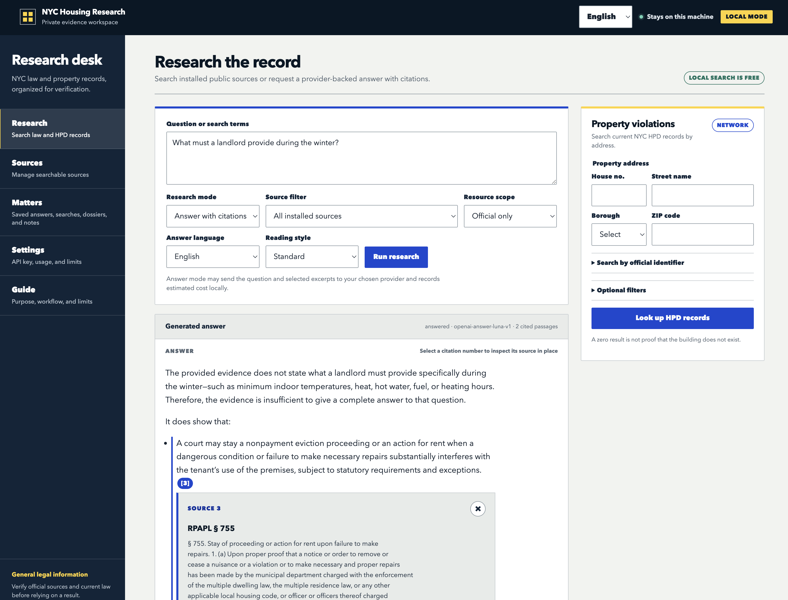

# NYC Housing Research

NYC Housing Research is a self-host-free, local browser application for cited
New York City housing-law research and bounded NYC HPD violation lookups. The
application, SQLite databases, legal-source artifacts, cache, and usage ledger
run on your machine. You may use keyless source search or supply your own model
API key for embeddings and generated answers.

This is general legal-information software, not legal advice. Verify sources and
current law before relying on a result.



## What works

- Downloads and locally indexes five official legal/guidance modules.
- Offers an optional, explicitly partial rent-regulation source pack with the NYC
  Rent Stabilization Law and curated DHCR guidance; unresolved RSC, ETPA, fact-sheet,
  and bulletin coverage is shown rather than implied.
- Imports user-provided PDF, DOCX, Markdown, and UTF-8 text resources for private
  local search, with structural DOCX locators, PDF text/OCR-readiness inspection,
  and explicit per-resource consent before provider-backed use.
- Searches citations and full text without an API key.
- Optionally builds a local semantic index and generates evidence-cited answers
  with a user-supplied OpenAI key, including Spanish-output and plain-language
  controls that preserve the cited source evidence.
- Looks up filtered property violations from the official NYC Open Data HPD
  dataset without downloading its roughly 11-million-row table.
- Organizes explicitly saved results into local research matters, compares retained
  official-source versions, and builds confirmed-identity property dossiers whose
  dataset panels remain separate and provenance-labeled.
- Provides deterministic, model-independent urgent-housing resource routing and
  English/Spanish interface catalogs; both are review-status labeled.
- Caches property pages for offline reuse, creates scoped exports, and supports
  secret-free workspace backup/restore.
- Enforces loopback-only access, one-use launch credentials, session/CSRF checks,
  exact local spend reservations, a user-lowerable one-or-two-call concurrency
  limit, and an offline egress policy.

Citywide HPD analytics, a complete offline HPD snapshot, a reviewed local-model
runtime, production OCR, and Docker remain independent optional extensions—not
L1 requirements. The interface reports those capabilities as blocked until a
reviewed artifact and evaluation are installed; cached property pages are never
presented as a complete snapshot.

## Standalone macOS application

The project can also be distributed as a drag-to-Applications DMG. The macOS
application bundles Python and the required dependencies, opens the same interface
in a native WebKit window, and uses the same workspace as the browser launcher.
Users do not need Git, Python, uv, or a terminal. Replacing the application with a
newer release preserves the workspace under Application Support. Supported older
workspaces get a native backup-and-upgrade confirmation before startup. Interrupted
upgrades offer recovery, and recovery copies can be opened directly; see
[upgrades and recovery](docs/Updating.md#desktop-workspace-upgrade).

The DMG is an additional build of this same codebase, not a separate frontend or
service. See [macOS application distribution](docs/macOS_Application_Distribution.md)
for local builds, Developer ID signing, notarization, and release verification.

## Quick start from a clone

After cloning, open a terminal in the repository and run one command.
On macOS or Linux:

```bash
sh start.sh
```

On Windows, in PowerShell:

```powershell
powershell -NoProfile -ExecutionPolicy Bypass -File .\start.ps1
```

The launcher obtains the tested runtime and Python 3.12 if needed, installs the
locked dependencies with secure-key-storage support, creates your local workspace,
downloads and verifies the five official sources, and opens the browser. There
are no setup questions and no model charges. An internet connection and a modern
browser are needed for first use; macOS/Linux also need `curl` or `wget`.
You do not need to install Python or uv yourself, edit `.env`, or activate an
environment. No administrator access or shell-profile changes are required.

Keep the terminal open while using the app. Press **Ctrl+C** to stop it. Run the
same command to reopen: it preserves your settings and installed sources. Source
updates remain available in the browser. If a publisher is unavailable, the
browser opens with recovery controls; rerunning the command retries unfinished
free installation. Runtime/dependency failures stop with a terminal error.

Optional arguments include `--no-browser`, `--skip-core`, `--setup-only`,
`--offline`, and `--data-dir "PATH"`; use `--help` for a summary. Offline first use
requires an already available runtime/dependency cache and skips source downloads.
If you already manage uv, the equivalent application command is
`uv run --extra credentials nyc-housing start`.

Free source search is ready after installation. To enable optional AI answers,
open **Settings** and add your OpenAI API key. Adding a key selects the packaged
models without a paid request; restart with the same launch command when prompted.
Connection testing and improved search have separate cost estimates and approval.
The browser opens Sources if installation was skipped or could not finish.

See [Setup](docs/Setup.md) for optional configuration and
[the implementation plan](docs/One_Command_Setup_Plan.md) for the launcher design.

Keyless search is available after the corpus installs:

```bash
uv run nyc-housing search "RPAPL section 711"
```

Personal resources can be added from **Sources → My resources** in the browser,
or from the CLI. They default to local keyword search only:

```bash
uv run nyc-housing resources add ./tenant-notes.md --title "Tenant notes"
uv run nyc-housing search "radiator log" --scope mine
uv run nyc-housing resources list --json
```

Use `resources model-use RESOURCE_ID allow` only when you want excerpts from
that resource to be eligible for semantic indexing and cited model answers.
Workspace backups include personal resources; portable corpus bundles exclude
them.

Research matters keep an immutable copy of each explicitly saved result and its
evidence while allowing editable notes. They can be searched and exported as a
checksummed ZIP:

```bash
uv run nyc-housing matters create "Heat complaint" --tag heat
uv run nyc-housing matters list --json
uv run nyc-housing matters show MATTER_ID --json
uv run nyc-housing matters export MATTER_ID
```

Retained versions of the same official module can be compared without a model.
The comparison aligns stable citations where possible and reports saved items
whose cited chunks changed:

```bash
uv run nyc-housing corpus diff MODULE_SLUG BASE_VERSION_ID TARGET_VERSION_ID --json
```

Optional source packs can be managed in **Sources → Available source packs** or
from the CLI. Pack installation does not change the five-module core-readiness
contract, and removal is preview-only unless `--apply` is supplied:

```bash
uv run nyc-housing packs list --json
uv run nyc-housing packs install rent-regulation
uv run nyc-housing packs check rent-regulation
uv run nyc-housing packs remove rent-regulation
uv run nyc-housing packs remove rent-regulation --apply
uv run nyc-housing packs restore rent-regulation
```

For advanced CLI users, the separate model configuration commands are:

```bash
uv run nyc-housing profiles select answer openai-answer-luna-v1
uv run nyc-housing profiles select embedding openai-embedding-3-small-v1
uv run nyc-housing credentials set openai
uv run nyc-housing credentials validate openai --approve-cost --max-cost-usd 0.000001
uv run nyc-housing corpus index --estimate-only
uv run nyc-housing corpus index --approve-cost --max-cost-usd 1.00
```

The credential command prompts without echoing. If no OS keyring is available,
install the `credentials` extra or deliberately choose the owner-readable local
fallback with `--storage file`. Never pass a key as a command-line argument.
Credential validation and corpus indexing can incur provider charges and both
require a displayed estimate, explicit approval, and a hard ceiling. The browser
offers the same estimate/approval workflow.

Advanced installations can point either selected OpenAI profile at an
OpenAI-compatible endpoint and give answer/embedding traffic separate credential
slots. Custom endpoints require retention metadata and either complete price
provenance or an explicit unknown-price declaration. They remain disabled until
`profiles check KIND` succeeds without fallback. Unknown-priced endpoints are
never eligible for automatic indexing/evaluation and require a separate one-off
approval for each manual answer or summary; those requests are labeled as outside
USD caps. See [Setup](docs/Setup.md#advanced-openai-compatible-endpoints).

## Operational commands

```bash
uv run nyc-housing status --json
uv run nyc-housing sources --json
uv run nyc-housing doctor --json
uv run nyc-housing diagnostics export ./nyc-housing-diagnostics.json --json
uv run nyc-housing migrate preflight --json
uv run nyc-housing usage --json
uv run nyc-housing evaluate --answers --estimate-only --json
uv run nyc-housing debug answer --question "What does RPAPL 711 cover?" --json
uv run nyc-housing maintenance prune --json
uv run nyc-housing offline status --json
uv run nyc-housing backup ./workspace-backup.zip
uv run nyc-housing restore ./workspace-backup.zip --destination ./restored-workspace
```

Use `--data-dir PATH` before the command to select a workspace, and `--offline`
to block application-managed remote HTTP before requests are made.
Retention cleanup is preview-only unless `maintenance prune --apply` is supplied.
It preserves active/nonterminal jobs, unresolved spend, current-month accounting,
and pinned property-cache entries.
The diagnostics export is local, redacted by default, owner-readable, and makes
no network or paid-provider request.

The answer-evaluation estimate is free. A real answer-suite run requires
`--answers --approve-cost --max-cost-usd N`; its automated checks are only a
technical screen and the report remains `domain_review_required`. Add
`--report ./answers.json` to deliberately save answers, cited excerpts, and
provenance. Use `review-answers ./answers.json --template ./review.json` to prepare
a human review, then `review-answers ./answers.json --review ./review.json --json`
to assess the completed judgments. See the
[answer-quality runbook](docs/Answer_Quality_User_Runbook.md).

## Documentation

- [Setup and first run](docs/Setup.md)
- [macOS application distribution](docs/macOS_Application_Distribution.md)
- [Coverage and limitations](docs/Coverage.md)
- [Privacy and data flow](docs/Privacy_and_Data_Flow.md)
- [Costs and budgets](docs/Costs.md)
- [Updating](docs/Updating.md)
- [Troubleshooting and recovery](docs/Troubleshooting.md)
- [Legacy migration](docs/Migration.md)
- [Contributing](docs/Contributing.md)
- [Security policy](SECURITY.md)
- [Third-party and source review inventory](docs/Third_Party_and_Source_Review.md)
- [Current beta-batch readiness](docs/Release_Readiness/2026-09-20_Beta_Batch.md)
- [Recovery and interrupted-upgrade follow-up](docs/Release_Readiness/2026-09-20_Recovery_Batch.md)
- [Historical L1 acceptance evidence](docs/Release_Readiness/2026-09-14_L1_Acceptance.md)
- [L1 requirement-by-requirement audit](docs/Release_Readiness/2026-09-15_L1_Requirement_Audit.md)

The original hosted PostgreSQL/S3 application remains in the tree as a legacy
entry path. Its runbooks are marked historical and are not the local quickstart.

## Release status and licensing

The local implementation is a release candidate. macOS arm64 and a built wheel
have been exercised locally; the repository includes native Linux, macOS, and
Windows CI and a configured GitHub remote. Successful CI evidence must be tied to
the final release revision; the workflow definition alone is not a passing run.
The five-source installer and bounded HPD connector have been live-verified;
paid-answer, domain-review, parity, and independent clean-machine gates are
recorded transparently in the acceptance report.

The original source code and documentation in this repository are licensed under
the [Apache License 2.0](LICENSE). Unless expressly stated otherwise, that license
does not apply to third-party legal texts, government datasets, downloaded corpus
artifacts, or third-party dependencies; those materials remain subject to their
respective terms. See the [license decision](docs/License_Decision.md) and
[third-party and source review](docs/Third_Party_and_Source_Review.md) for scope
and remaining release checks.
